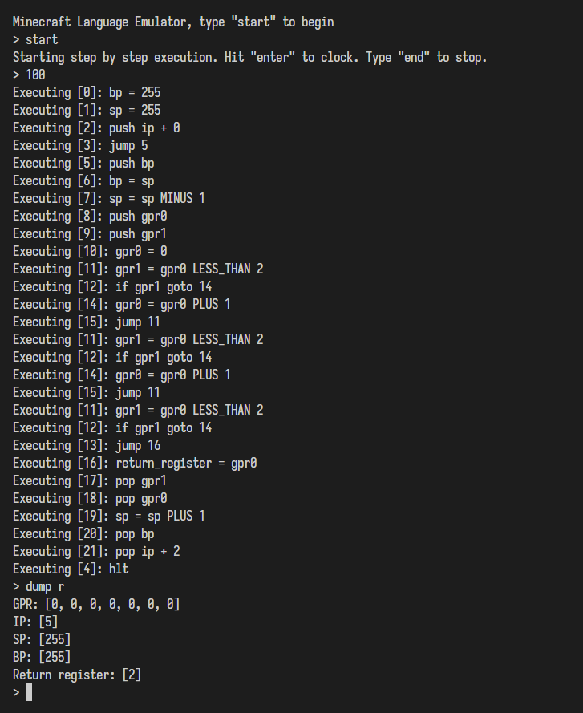

# Dust Compiler 

This project implements a compiler for Dust, a C-like language targetting a Minecraft Redstone Computer. 

Dust is a combiantion of C semantics with JavaScript / TypeScript syntax that compiles down to a thin instruction set that can be executed on a Minecraft Redstone Computer.

```js
// An implementation of the Fibonacci sequence in Dust
function main () {
  var n1 = 0;
  var n2 = 1;
  var nextterm = 1;
  var i = 0;

  while loop (i < 5) {
    nextterm = n1 + n2;

    n1 = n2;
    n2 = nextterm;

    i = i + 1;
  }

  return nextterm;
}
```

## Pipeline:

 - Front-end
   - Lexer - A lexer is implemented using [Slex](https://github.com/scinscinscin/slex), which generates a stream of tokens on-demand.
   - Parser - A parser is implemented using [Sparse](https://github.com/scinscinscin/sparse), which creates an LR(1) parser from a set of productions defined in [grammar.txt](src/grammar.txt).
 - Middle-end
   - Intermediate Representation - Each translation unit is converted to a three address code intermediate representation.
   - Optimizer - The IR is converted into Single Static Assignment (SSA) form so that dataflow optimizations can be performed.
     - Constant propagation - replace and compute expressions whose values are known at compile time
     - Dead code elimination - remove instructions which compute unused values
       - Functions are ignored as there is currently no way to tell if they have side-effects
 - Back-end
   - Register coloring - Each translation unit optimized by the compiler is converted into a register interference graph, upon which Chaitin's algorithm is applied to assign registers. 
   - Code Generation - The SSA form is killed by adding new predecessors to each block that coalesce register usage.
   - Linking - All translation units are linked together into a single output, replacing jump labels with final absolute addresses.

## Virtual Machine:

This project implements a step-by-step Virtual Machine REPL that executes the linked code to test programs without having to run them in Minecraft.



The Virtual Machine allows you to
 - Step through the code
 - Run multiple lines at once
 - Inspect the state of the stack / registers
 - Peek and poke into memory

## Things that would be nice to implement:

 - [x] - Pointer dereferencing
   - [x] - Reading from pointer dereference `foo = *bar`
   - [x] - Writing to pointer dereference `*bar = foo`
 - [ ] - Static variable location
 - [ ] - Type checking
   - [ ] - Structures and arrays
 - [ ] - Standard Library
 - [ ] - Register spillage
 - [ ] - Code optimization
   - [ ] - Remove temporary blocks that coalesce registers in the same way
   - [x] - Implement constant folding / propagation
 - [ ] - Emitting Minecraft schematic files

---

**Things that have been done:**
1. Convert the AST to a three address code intermediate representation
2. Create the basic blocks of a given function and form the control flow graph
   1. The first three address instruction in the intermediate code is a leader
   2. Any instruction that is the target of a conditional or unconditional jump is a leader
   3. Any instruction that immediately follows a conditional or unconditional jump is a leader
3. Convert the TAC IR to SSA form
   1. Determine the dominators of the CFG
   2. Determine the dominance frontiers of each node of the CFG
   3. SSA conversion
      1. For each variable, find all blocks that define it
      2. Put phi nodes in the iterated dominance frontier of those blocks
      3. Build dominance tree and perform DFS with stack to add operands to phi nodes and replace variable invocations with SSA ones.
4. Perform liveliness analysis
   1. Compute USE and DEF per block
   2. Compute the live in and live out of each block
   3. Construct the register interference graph
      1. Traverse each basic block backwards with `live` starting as its live out
      2. For each instruction that defines a variable, add an edge from every operand in live to the defined variable
      3. Remove the defined variable from live and add the operands it uses
5. Code generation
   1. Kill the phi nodes by adding new predecessors to block that coalesce register usage
      1. Predecessor blocks are created generating the entry point of a function
      2. Instructions are based on edges whose target registers aren't needed anymore
         1. If a loop is detected, it is broken by pushing the source to the stack to pop to the target later
   2. Emit callee preamble that prepares stack frame
   3. Emit code sequentially, replacing jumps with "on-edge" predecessors
   4. Emit callee epilogue that deallocates stack frame
6. Linking and Loading
   1. Each translation unit is linked into a single output, removing labels
   2. Unnecessary jumps (jumps that go to the next instruction) are also removed
7. Virtual Machine
   1. An emulator for the Minecraft computer is implemented to test programs
   2. VM loads in REPL and allows for step-by-step execution to see program states

## Resources
 - The Dragon Book - everything related to parsing theory and the algorithms used to create Sparse and Slex. 
 - https://web.stanford.edu/class/archive/cs/cs143/cs143.1128/ - Compilers 101 up to data flow optimization. Issues: It handwaves a lot of the details like for example: SSA
 - https://en.wikipedia.org/wiki/Static_single-assignment_form - Cytron's SSA algorithm was directly implemented in this compiler to create the control flow graph and SSA form
 - https://dl.acm.org/doi/pdf/10.1145/872726.806984 - The Chaitin algorithm is used to assign registers, only partially implemented.
